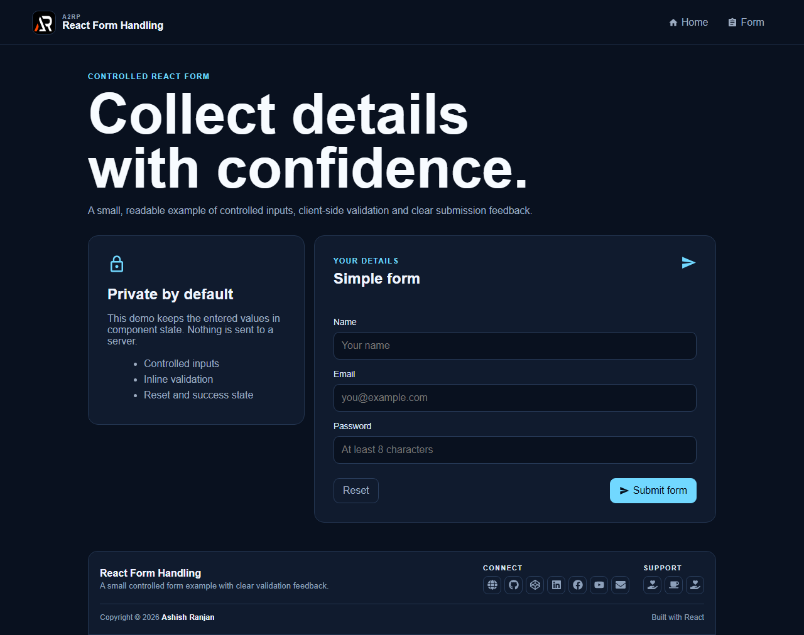

# React Form Handling

A small controlled React form that demonstrates state-driven inputs, client-side validation and clear submission feedback.

## Features

- Controlled name, email and password inputs
- Inline validation for required values and password length
- Reset action and visible success state after a valid submit
- Responsive fixed header and icon-only footer
- GitHub Pages deployment

## Tech stack

React, Create React App and react-icons.

## Run locally

npm install
npm start

Test and build:

npm test -- --watchAll=false
npm run build

## Deployment

Live: https://a2rp.github.io/react-form-handling/

## Links

- Portfolio: https://www.ashishranjan.net/
- GitHub: https://github.com/a2rp
- CodePen: https://codepen.io/ash1198
- LinkedIn: https://www.linkedin.com/in/aashishranjan
- Facebook: https://www.facebook.com/theash.ashish/
- YouTube: https://www.youtube.com/@ashishranjan-ashz?sub_confirmation=1
- Email: mailto:ash.ranjan09@gmail.com

## Support

- Support: https://a2rp-donation-page.netlify.app/
- Buy Me a Coffee: https://buymeacoffee.com/a2rp
- Patreon: https://patreon.com/a2rp
